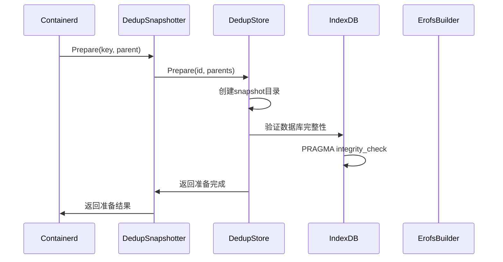
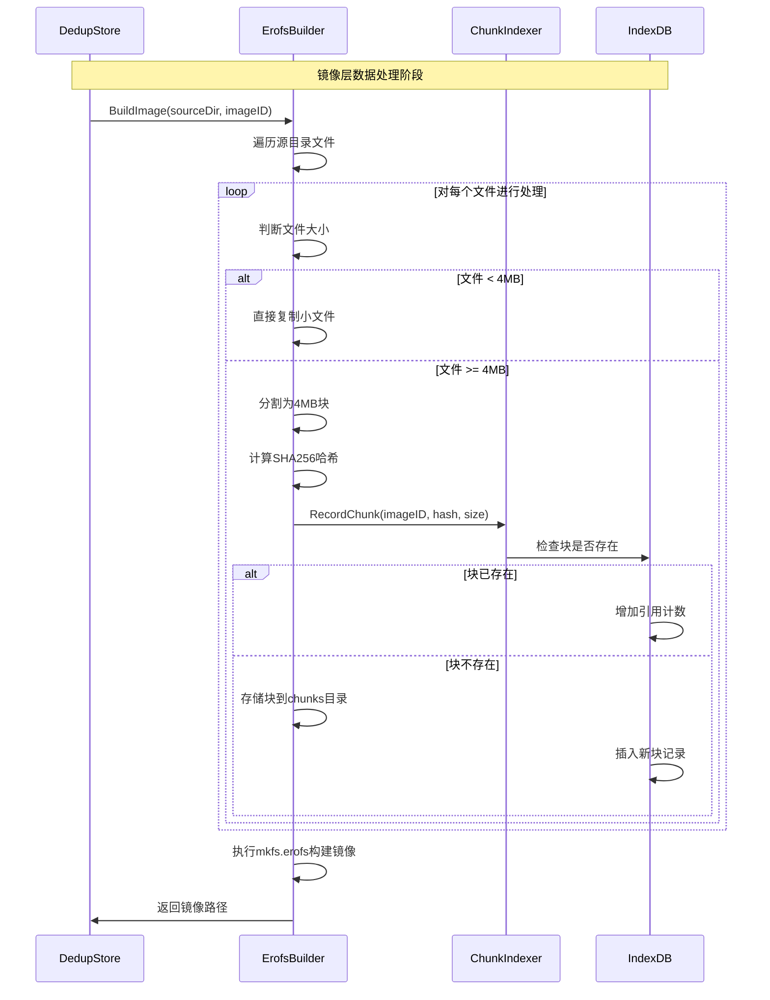
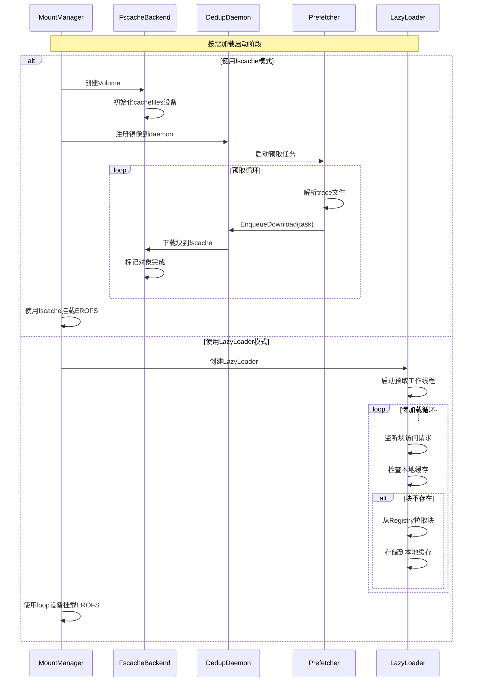
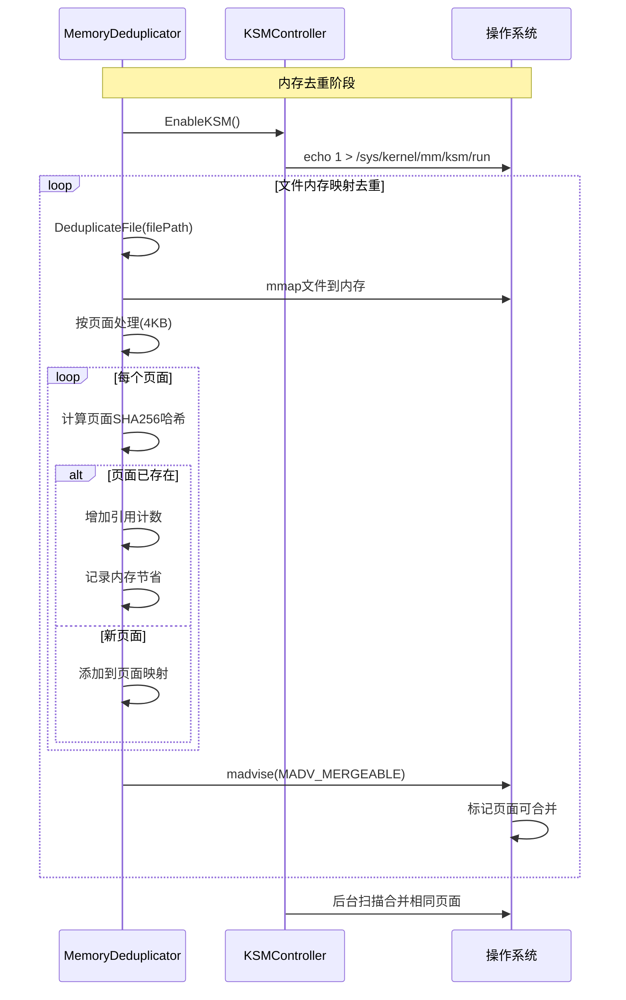
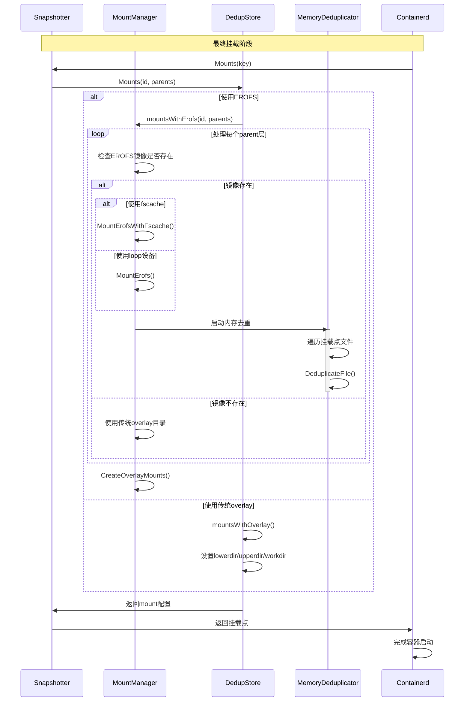

# 容器冷启动全流程图 - 包含数据去重、按需加载时序逻辑

## 系统架构概览

```mermaid
graph TB
    subgraph "容器冷启动全流程"
        A[容器启动请求] --> B{镜像层是否存在?}
        B -->|否| C[从Registry拉取镜像]
        B -->|是| D[检查本地存储]

        C --> E[镜像层处理]
        D --> E

        subgraph "数据去重处理"
            E --> F[块级分割 4MB]
            F --> G[计算SHA256哈希]
            G --> H{块是否已存在?}
            H -->|是| I[增加引用计数]
            H -->|否| J[存储新块]
            I --> K[更新索引数据库]
            J --> K
        end

        subgraph "EROFS镜像构建"
            K --> L[构建EROFS镜像]
            L --> M[压缩优化 LZ4HC]
            M --> N[生成镜像元数据]
        end

        subgraph "按需加载机制"
            N --> O{使用fscache?}
            O -->|是| P[初始化fscache后端]
            O -->|否| Q[使用LazyLoader]

            P --> R[注册镜像到fscache]
            Q --> S[设置预取队列]

            R --> T[创建挂载点]
            S --> T

            T --> U[解析访问追踪文件]
            U --> V[启动预取任务]
        end

        subgraph "内存去重"
            V --> W[启动KSM内核模块]
            W --> X[页面级内存去重]
            X --> Y[madvise MADV_MERGEABLE]
        end

        subgraph "容器文件系统挂载"
            Y --> Z[创建Overlay挂载]
            Z --> AA[设置lowerdir/upperdir/workdir]
            AA --> BB[完成容器启动]
        end
    end
```



## 详细时序流程

### 1. 冷启动初始化阶段



### 2. 镜像层处理与数据去重



### 3. 按需加载与预取机制



### 4. 内存去重机制



### 5. 容器挂载与启动完成



## 核心数据结构与存储

### 去重数据索引结构
```sql
-- 块级去重索引表
CREATE TABLE chunks (
    hash TEXT PRIMARY KEY,      -- SHA256哈希值
    size INTEGER,              -- 块大小
    ref_count INTEGER DEFAULT 1 -- 引用计数
);

-- 文件到块的映射表
CREATE TABLE files (
    path TEXT PRIMARY KEY,      -- 文件路径
    chunks TEXT                -- 块哈希列表(逗号分隔)
);
```

### 预取追踪数据格式
```
# trace文件格式示例
chunk_hash_1
chunk_hash_2
chunk_hash_3
...
```

## 关键性能优化点

1. **块级去重**: 4MB块大小平衡去重率和性能
2. **EROFS压缩**: LZ4HC算法提供高效压缩比
3. **Fscache集成**: 内核级缓存减少用户态开销
4. **预取策略**: 基于访问模式的智能预测
5. **内存去重**: KSM内核模块页面级合并
6. **并发控制**: 多线程预取和索引操作
7. **崩溃恢复**: WAL日志和完整性检查机制

## 故障处理与恢复

1. **数据库恢复**: 检测锁文件和WAL文件状态
2. **引用计数修复**: 重建索引维护数据一致性
3. **快照验证**: 元数据和文件系统完整性检查
4. **优雅降级**: fscache失败时回退到loop挂载

这个流程图详细展示了dedup-snapshotter的容器冷启动全过程，包含了数据去重、按需加载的完整时序逻辑和核心实现机制。